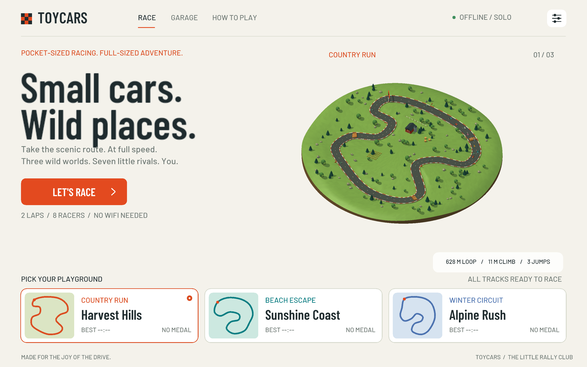

# ToyCars

**Small cars. Wild places.** An offline 3D pocket rally, written in C11 and SDL3.



## Play on macOS

From the project directory, build and launch the game with one command:

```sh
make run
```

To show live FPS and disable VSync while keeping normal game speed:

```sh
make run ARGS="--fps --no-vsync"
```

F1 toggles the statistics overlay. FPS measures real elapsed time, including
in the fixed-step `--benchmark` mode.

To preview the mobile menu and touch controls directly in a macOS window,
without an emulator or simulator:

```sh
make run-mobile
```

This uses the mobile layouts in a 874 x 402 landscape window, with mouse input.
Override the window size or open a specific screen with, for example,
`make run-mobile ARGS="--size 1000x460 --screen garage"`.

`make` builds without launching; `make test` builds and runs the tests.
Pass game options with, for example, `make run ARGS="--track winter --autoplay"`.
Development builds need CMake and SDL3 installed.

In this workspace, a ready-to-open application is in `dist/ToyCars.app`:

```sh
open dist/ToyCars.app
```

Build the Android test package with `./tools/build_android.sh` (mobile toolchain
setup is in [Mobile builds](docs/MOBILE.md)). The script creates
`dist/ToyCars-android-arm64-debug.apk`; generated packages are not tracked in Git.

SDL3 is the only runtime library. CMake finds the Homebrew installation automatically.
The equivalent CMake commands are:

```sh
cmake -S . -B build -DCMAKE_BUILD_TYPE=Release
cmake --build build -j
./build/ToyCars
```

The generated `build/assets` folder belongs beside the executable. Every build
refreshes it, including builds after only changing an asset. The game does
not download anything and does not require Blender, Python, SDL_ttf, a login, or
an internet connection to run.

## In the box

- Three individually shaped, elevated 3D tracks: **Harvest Hills**, **Sunshine
  Coast**, and **Alpine Rush**. Harvest Hills has an outer loop and a woven
  infield (1.09 km, three crossings); Sunshine Coast has three broad coastal
  lobes (0.99 km, three crossings); Alpine Rush has long switchbacks and a
  diagonal return (0.96 km, two crossings). Each has bridges with open underpasses,
  smooth elevated approaches,
  banking, three physical jump ramps and four fuel pickups near the road edges.
  [Compare the three layouts](screenshots/track-layouts.svg).
- Habitat-specific surroundings: flowering meadow and hedgerow patches in
  Harvest Hills, dune grass, coastal scrub and driftwood on Sunshine Coast,
  and dwarf pines, scree and fallen branches in Alpine Rush. Grass, sand and
  snow have subtle procedural surface variation without extra texture assets.
- Animated wildlife away from the road: grazing deer, hopping hares, geese
  near country water, snakes in the warmer tracks, and birds circling overhead.
  The three tracks contain 28 / 20 / 17 animals. Articulated movement also
  animates shadows and freezes when paused. Wildlife is decorative and does
  not collide with cars. Ground paths are checked against the terrain during
  asset generation; each track adds one wildlife draw per scene/shadow pass.
- Eight-car, two-lap races. Seven rivals steer, brake, select overtaking lines,
  plan fuel stops and recover if stuck. Three difficulty levels.
- A substantial shortcut across terrain returns the car to its last legal road
  position and stops it. Detection compares the actual distance driven with the
  skipped road distance; ordinary shoulder excursions keep their progress.
  Brief exits have a one-second grace period unless they save over 24 meters.
  Manual recovery cannot keep progress gained through a shortcut.
- **Championship:** race Harvest Hills, Sunshine Coast and Alpine Rush as one
  series. Places 1–8 earn 10 / 8 / 6 / 5 / 4 / 3 / 2 / 1 points; a DNF earns zero.
  Finish in the top four in each of the first two stages to advance and unlock
  the next track. Fifth or worse, or a DNF, eliminates you and ends that run.
  The HUD shows live
  projected overall position, with race position secondary. Results show the
  overall points table; standings are final once all rivals finish or retire.
  Equal totals are resolved by most wins, then most second places and so on;
  exact ties use stable driver order.
  After all three stages, overall first / second / third wins a gold / silver /
  bronze medal with a matching celebration. Fourth or worse loses the championship.
  Winning the final race alone does not guarantee a championship medal.
  Progress and each driver's classification save after each settled stage.
  Initials are requested after the opening finish and reused on later stages.
  **NEXT STAGE**, Enter or gamepad A continues after rivals finish if you qualify.
  Final or elimination results return to the menu, where a new championship starts from zero points
  while unlocked tracks, records and the best championship medal remain saved.
  Older saves keep their unlocked tracks and records and start a new points series.
  Preview the celebration with `./build/ToyCars --screen championship`
  (does not save progress).
- **Arcade:** single races on unlocked tracks for medals and personal records.
  Arcade results do not advance Championship. Locked tracks can be previewed
  and show which Championship stage to clear.
- Momentum, lateral tire grip, drifting, different surface grip, oriented car
  collisions, gravity, takeoff and landing. Leaving the road costs speed.
  Tire grip limits cornering: entering too fast causes a gradual loss of traction,
  sending the car into a sideways skid that widens the turn and scrubs speed,
  especially on snow. Ease the steering and slow down to regain traction.
  Brake before tight corners; holding Drift trades more grip and speed for rotation.
  Rivals use the same physics and plan braking around the surface limits.
- Collectible fuel, fuel exhaustion, lap validation, race position, race time,
  lap time, final classification, podium medals and local personal records.
  Finishers lead the classification, followed by active racers and then DNF cars.
  Within the DNF group, greater distance takes priority, with stable driver order breaking ties.
- If saving a finish fails, every stage offers **RETRY SAVE** or **CONTINUE UNSAVED**
  before leaving the results. Enter / gamepad A retries; Esc / gamepad B continues
  unsaved. In the initials form, Enter / Start saves and Esc / B continues unsaved
  after a save failure. Unsaved progress remains in memory and is included in the
  next successful profile save; quitting before that loses the unsaved changes.
- Settings, car colors and the keyboard sound toggle use the same save warning.
  Failed writes offer **RETRY SAVE** or **CONTINUE UNSAVED** and block covered
  controls. A failed sound-toggle save during a race pauses it; saving successfully
  returns to the pause menu so the race resumes only when requested.
- **Track records:** a local Top 10 for each circuit and the latest 30 finishes,
  with three-letter arcade initials, millisecond race times, best lap, date,
  race mode, difficulty and finishing position. New records show how much you
  improved. Both modes and all difficulties share each track's board.
- After an **Arcade** finish, enter your initials with the keyboard, touch letter selectors
  or gamepad D-pad. Your last initials are remembered. **TRACK RECORDS** opens
  the board from Arcade track selection or Arcade race results; **RECENT HISTORY** shows your
  latest runs and highlights the records you broke. Old best times are preserved
  as imported records with unknown initials and dates.
- Arcade track cards show your personal best race time and highest medal;
  tracks you have not finished show `BEST --:--`.
- A live 3D track selector, garage with six liveries, controls guide, settings,
  countdown, pause, restart, results and next-track flow. English throughout.
- After crossing the finish, cars ease into a slow cooldown lap on the right,
  keeping space between them while the results are displayed.
- **RESET DATA** in settings asks for confirmation, then clears championship
  progress, medals, records, race history and initials, and restores default
  settings and car color. The reset is saved immediately.
- Independent multitouch steering and brake/drift controls, automatic or manual
  acceleration, keyboard and hot-plugged gamepad input. Acceleration is manual
  by default; automatic acceleration can be enabled in settings.
  On mobile, grab and rotate the steering wheel for proportional steering;
  release to center it. The wheel and pedals support independent fingers.
- Soft moving cloud shadows follow world position and elevation across roads,
  scenery, cars and water, including the track previews. Shaded areas receive
  cooler skylight, with subdued water glints and matching cloud reflections.
  Clouds drift with the breeze and weather, soften under overcast skies, and
  freeze when paused. The effect needs no extra draw calls or texture assets.
- Filtered real-time shadows, vertex-colored Blender models, smooth terrain,
  distance fog, edge smoothing, dust, pickup and landing particles.
- Terrain-led streams: a meandering meadow creek feeds an irregular pond with
  shallow inlets and sediment shelves, a sand-bar creek widens into a coastal
  estuary, and a narrow alpine stream winds through rock constrictions. Channels
  vary in width and bank vegetation. Roads cross them on bridges or through
  shallow, curb-free fords. Water has a visible gravel bed, depth-dependent
  tint, refraction, reflections, moving highlights, small waves and bank foam.
  All eight cars throw translucent spray from wet tires and leave expanding
  ripples; airborne or stopped cars do not spray. Water and droplets pause with
  the race. Banks have stones and, in the countryside, reeds.
- Cars retain angular momentum and can overturn after strong impacts, abrupt
  terrain changes or uneven landings. Wheel contact is checked independently, so
  driving one side over an edge can remove its support. Tire support, chassis contact and friction
  let them settle on their side or roof, or regain traction after landing on their
  wheels. All cars automatically recover after resting on their side or roof for
  three seconds. Use **R / RECOVER** to recover manually when stranded.
- Six striped traffic cones surround a rough asphalt repair patch beside each
  circuit. Six sections have outer-bend barriers of five stacks of three loose
  tires (90 tires per circuit), spaced apart and kept clear of jumps and water.
  Each cone and tire has its own mass, angular velocity and compound collision
  hull: impacts transfer momentum, cones rock or tumble, and tire stacks can
  collapse and roll away. Ground friction and restitution settle loose objects;
  sleeping bodies avoid idle simulation work. All eight cars can hit them.
  Pausing freezes the objects and restarting restores their original positions.
- Short orange rally safety nets mark four selected outer bends per circuit,
  set back from the road and kept clear of water and jumps. Flexible woven panels
  deform on impact and fold stakes around their planted feet, with damped motion
  that keeps them close to the ground; every car can hit them.
  The fences pause with the race and reset on restart.
- Rally spectators in 15 scattered groups on each circuit: adults, children,
  older fans, photographers and flag bearers with summer or winter clothing.
  Fans wave, clap, hop and sway at individual tempos, with fluttering flags
  and matching animated shadows. Pausing the game freezes their animation.
- A countryside landscape park with open lawn, winding gravel walks, grouped
  deciduous trees, loose shrubs and benches beside the paths. Additional empty
  and occupied benches stand individually on natural ground around each circuit,
  with locations checked against roads, water, scenery and steep slopes.
- Television crews on every circuit: four trackside tripod cameras and a broadcast
  compound with a fifth camera, TV van, satellite dish, reporter, boom operator,
  vision technician, monitors, flight cases and cables. Eight crew members wear
  media vests and headsets; equipment is placed clear of roads, water and scenery.
- A small camera helicopter patrols beside the race on all three circuits,
  occasionally drawing closer during a relaxed 48-second flight cycle. Both
  rotors turn and cast shadows; pausing freezes the helicopter too.
- Occasional weather with gentle five-second transitions: rain in Harvest Hills
  and Sunshine Coast, snow in Alpine Rush, and gusts carrying leaves, sand or
  loose snow. Showers soften sunlight and bring haze; flags react to the wind.
  Races start clear, with longer clear spells between weather events. Each retry
  gets a new forecast. Weather pauses with the race and leaves car handling unchanged.
- Seven original synthesized compositions: a relaxed paddock theme and two
  distinct tracks per environment. Extended harmonies, evolving 64-bar arrangements,
  melodic answers and breathing spaces; adaptive layers follow speed, close racing
  and the final lap. Engine audio and event sounds remain audible in the mix.
  No external audio files or streaming service.

## Controls

| Action | Keyboard | Touch | Gamepad |
| --- | --- | --- | --- |
| Steer | A / D or left / right | Rotate the wheel (analog) | Left stick |
| Accelerate | W / up | GAS | Right trigger |
| Brake / reverse | S / down | BRAKE | Left trigger |
| Drift | Space | DRIFT with auto accelerate enabled | A / south button |
| Recover | R | RECOVER | — |
| Pause / resume | Escape | Pause button | Start |
| Start / retry (next stage after a Championship race) | Enter | Menu buttons | A / south button |
| Select track in menu | 1 / 2 / 3 | Track cards | Use touch or mouse |
| Switch race mode | Tab | Championship / Arcade buttons | Use touch or mouse |

Hold the brake to stop, then keep holding to reverse at low speed with any
control method. Release it to accelerate forward in automatic mode, or use
the accelerator in manual mode.
| Enter record initials | A–Z; arrows select/change letters; Enter saves | Letter + / − and Save | D-pad; A accepts a letter; Start saves |
| Switch record view / page | Tab / left–right | Tabs / page buttons | Y / D-pad left–right |
| Diagnostics | F1 | — | — |
| Screenshot | F2 | — | — |
| Fullscreen | F11 | Automatic | — |

**Fuel:** a can restores 18 percentage points and respawns after 35 seconds for
each driver independently. Four cans per circuit alternate between the road edges;
you need to steer toward them to collect them. Consumption scales with circuit
length, and AI drivers plan fuel stops before entering reserve. A full tank cannot cover a complete
race at race speed without pickups, and a recently collected can can still be
unavailable on the next lap. **R** recovers your car without adding fuel or race
progress. Backgrounding the app pauses the race, including a quick background/foreground
round trip during the countdown; resume explicitly when ready.

## Blender source

The game meshes were actually modeled and exported in **Blender 5.2**. Open the
editable scenes in `art/`:

- `rally_car.blend` — beveled rally body, glazing, mirrors, striped roof, wheels,
  wing, lamps and bumpers.
- `fuel_can.blend` — the collectible jerrycan.
- `helicopter.blend` — camera helicopter with separately animated main and tail rotors.
- `country.blend`, `beach.blend`, `winter.blend` — complete themed scenes with
  terrain, road, curbs, ramps, buildings, trees and props.

Each circuit combines two-lane roads with a four-lane passing section of twice
the width. Country and coast have long passing sectors; the alpine switchbacks
have a shorter 44 m straight. Entry and exit tapers connect the constant-width
sections; lane markings, shoulders and gameplay boundaries follow the road.
Paired, gently curved tire marks with subtle color and faded ends cluster and overlap
in sharper bends. They are present on all three circuits
from the start and follow the road elevation and banking.

Reproduce all six scenes and their runtime exports:

```sh
/Applications/Blender.app/Contents/MacOS/Blender -b --python tools/build_assets.py
cmake --build build
```

The Blender script is an authoring tool. Gameplay and rendering run in C.
The custom mesh and track formats are documented in [Architecture](docs/ARCHITECTURE.md).

Font atlases are already bundled. To rebuild them, install SDL3_ttf for this
development-only step and run:

```sh
cmake -S . -B build -DTOYCARS_BUILD_FONT_BAKER=ON
cmake --build build --target bake_fonts
./build/bake_fonts assets/fonts/Barlow-Medium.ttf assets/fonts/body.tcf
./build/bake_fonts assets/fonts/BarlowCondensed-SemiBold.ttf assets/fonts/display.tcf
```

## Mobile builds

See [Mobile build and testing](docs/MOBILE.md). The Android project builds an
ARM64 APK. The iOS CMake target creates an Xcode project and an app bundle.
Both use the same C sources, bundled content and OpenGL ES 3.0 renderer.

## Verification and demos

```sh
ctest --test-dir build --output-on-failure
python3 tests/track_layouts.py
./build/ToyCars --test
./build/ToyCars --autoplay --track winter
./build/ToyCars --screen garage
./build/ToyCars --screen records
./build/ToyCars --screen race --autoplay --benchmark --frames 600 \
  --no-audio --screenshot screenshots/demo.bmp
```

The headless tests drive complete races on every track at all three difficulty
levels and check fuel, AI progress, jumps, lap progression, recovery, pause,
fuel exhaustion and independent multitouch input. Regression tests cover finish-line
recrossing, lasting landing slowdown, independent pointer clicks, canceled input,
ground contact and slope alignment off the road, free off-road movement around
bends, genuine corner shortcuts versus harmless shoulder excursions across
checkpoints and finish lines, terrain resistance and island-edge recovery, and
copying changed or newly added assets without recompiling C sources.
Record tests cover sorting, ties, Top 10/history limits, initials, saving and
reloading, legacy migration, malformed data, save failure and diagnostic/DNF
exclusion. Graphics checks exercise the initials form, keyboard shortcuts,
touch and gamepad record controls, and history pagination.
They also cover close finishes within one simulation step, consistent lap and
finish timing, ramp edge and corner exits, and drift braking across input sources.
See [Validation](docs/VALIDATION.md)
for executed checks and remaining release work.

The headless music test renders every complete composition, checks output levels,
transitions, playlist rotation, mute and adaptive layers. To export 45-second stereo
WAV previews of all seven tracks (without starting the game or an audio device):

```sh
mkdir -p build/music-preview
./build/ToyCarsMusicTests --render build/music-preview
```

See [Soundtrack](docs/SOUNDTRACK.md) for the track list and arrangement design.

After rebuilding the Blender scenes, verify road markings, terrain contact and spectators:

```sh
/Applications/Blender.app/Contents/MacOS/Blender -b --python-exit-code 1 --python tests/track_markings.py
/Applications/Blender.app/Contents/MacOS/Blender -b --python-exit-code 1 --python tests/ground_contact.py
/Applications/Blender.app/Contents/MacOS/Blender -b --python-exit-code 1 --python tests/spectators.py
/Applications/Blender.app/Contents/MacOS/Blender -b --python-exit-code 1 --python tests/broadcast.py
/Applications/Blender.app/Contents/MacOS/Blender -b --python-exit-code 1 --python tests/water_layout.py
```

Diagnostic runs (`--autoplay`, `--frames` or `--screen`) leave personal records,
medals and Championship progress unchanged, including in memory. Diagnostic
track selection can exercise locked tracks. Settings can still be saved normally.

The optional graphics regression test requires a desktop display. It exercises
the real event loop, replaces the GL context, checks portrait input blocking and
wide results, and uses an isolated profile under the build directory:

```sh
cmake -S . -B build -DTOYCARS_GRAPHICS_TESTS=ON
cmake --build build -j
ctest --test-dir build --output-on-failure
python3 tests/track_layouts.py
```

Use `ctest --test-dir build -LE graphics --output-on-failure` for headless checks
when the graphics test is enabled.

For memory checks:

```sh
cmake -S . -B build-asan -DTOYCARS_SANITIZE=ON -DCMAKE_BUILD_TYPE=Debug
cmake --build build-asan -j
./build-asan/ToyCars --test
```

Wildlife and habitat authoring lives in `tools/habitats.py`, called by the
normal Blender asset builder. Animal geometry remains editable in each
`art/*.blend`; `assets/tracks/*-wildlife.tcf` stores the separate animated mesh
(`TCF1`, little-endian vertex count, 18 floats per vertex: position, normal,
color, paint, origin/yaw, species, part, ground slopes). The runtime shares
animation code between visible and shadow passes. Validate placement/export
with `blender -b --python-exit-code 1 --python tests/wildlife.py`.
The terrain uses paint values -1 / -2 / -3 to select meadow / sand / snow
surface shading; ordinary model paint remains in the 0–1 range.

C sources use the repository's `.clang-format` style. To keep changes readable:

```sh
clang-format -i main.c src/*.c src/*.h tools/bake_fonts.c
```

## Design research and credits

[Research and design notes](docs/RESEARCH.md) describe the references and the
specific decisions drawn from them. ToyCars uses original environments and
models, not copied game assets. Barlow fonts are bundled under the SIL Open Font
License in `assets/fonts/`. SDL3 uses the zlib license; its source download keeps
that license in `third_party/SDL/LICENSE.txt`.

This is a playable first release candidate for iteration. Physical-device
performance profiling, broader playtesting, store signing and store submission
are separate release steps; see the validation document for the exact tested scope.

Trees and palms sway with the weather's wind direction, strength and gusts. Roots
stay planted, palms bend more than firs, and palm fronds flutter independently.
Color and shadow passes share the deformation and adjusted normals. A persistent
light breeze keeps trees visibly swaying during clear spells and in the menu;
weather gusts add stronger motion. Pausing freezes the animation.
The asset builder exports `*-vegetation.tcv` separately from static scenery:
`TCV1`, little-endian vertex count, 18 floats per vertex (position, normal, color,
paint, root xyz, reference height, flexibility, frond flag, two reserved zeros).
Graphics tests check visible motion in both the everyday breeze and stronger
gusts, as well as frozen animation during pause, on all three tracks.

Boost pads: each circuit has three muted teal pads with smoothly animated chevrons on dry, straighter stretches.
Drive over them in the race direction to gain up to 7 m/s (capped at 40 m/s).
Pads work for every driver, require ground contact, and have a two-second per-car cooldown.
At racing speeds, a radial blur builds along the sides of the image, with a brief boost accent.
The central road and HUD stay sharp; slow driving and pause have no speed blur.
